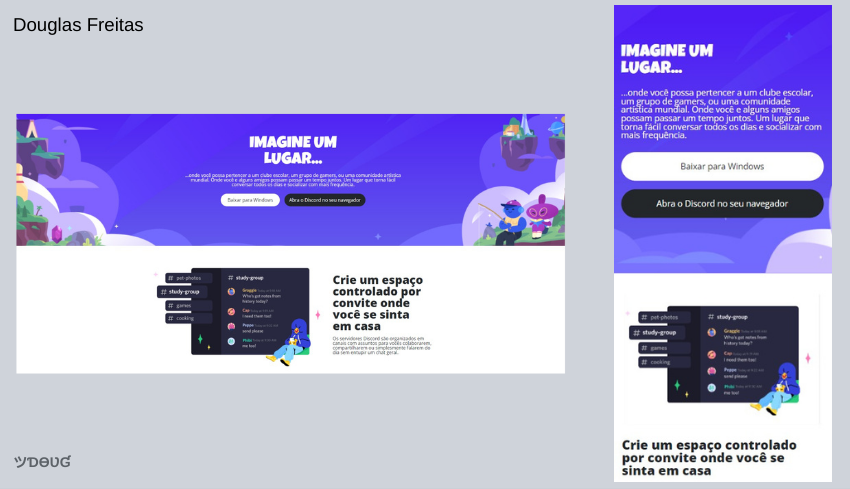

# Discord Responsivo

-  *Desafio da DIO developer CSS: clone do discord Responsivo!*

[🔗Clique aqui pra acessar](https://douglasffjw.github.io/MarioGame/)

## 🛠 Tecnologias

- HTML
- CSS 
- Figma

<table>
  <tr>
    <td align="center">
      <a href="https://github.com/Douglasffjw">
         
        
          <b>Douglas Freitas</b>
        
      </a>
    </td>
  </tr>
</table>

